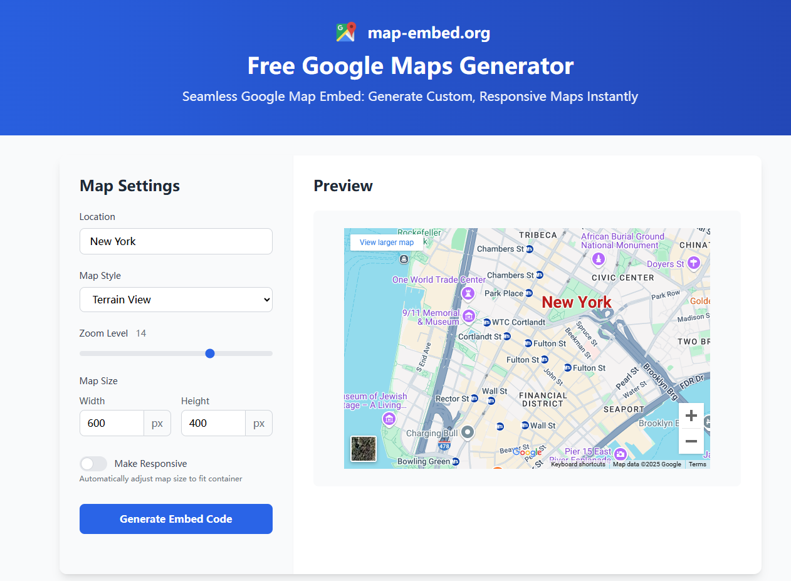

# Google Map Embed

## How to Embed the Map With Free [Google Maps Generator](https://map-embed.org/)
1. Adjust the settings in the options panel to configure your map.

2. Once you're happy with the preview, click on "Generate Embed Code."

3. Copy the generated code and paste it into your website's HTML where you'd like the map to appear.